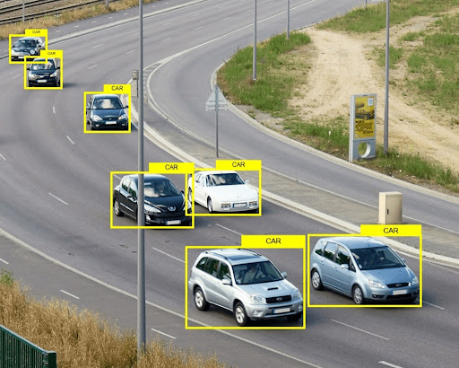
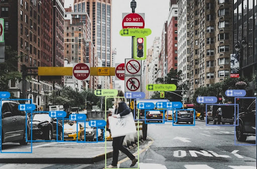
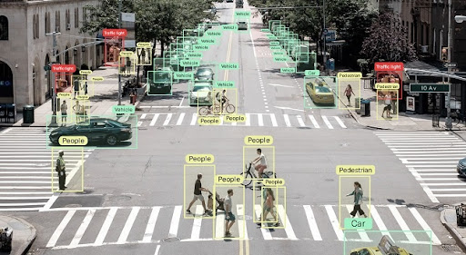
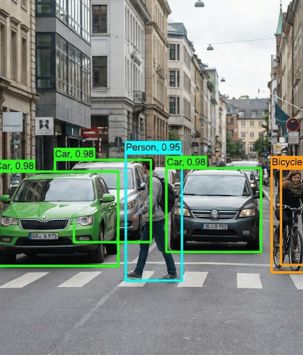

# AI Data Annotation & Evaluation Portfolio

A practical portfolio demonstrating different forms of **AI data annotation, data labeling, AI evaluation, content moderation, sentiment analysis, quality assurance, and multimodal dataset preparation**.

The examples cover:

- AI Response Evaluation
- Content Moderation
- Sentiment Analysis
- Text / NLP Annotation
- Image Annotation
- Video Annotation
- Audio Annotation
- 3D / LiDAR Annotation
- Multimodal Annotation
- Computer Vision Object Detection
- Annotation Quality Assurance

> **Raw Data → Human Annotation / Evaluation → Structured Dataset → Model Training or Evaluation**

---

## 📌 What is Data Annotation?

**Data annotation** is the process of adding meaningful labels, categories, boundaries, ratings, tags, attributes, or metadata to raw data so that AI and machine learning systems can learn from it or be evaluated against it.

The annotation method depends on the type of data and the purpose of the AI system.

Examples:

- **Text:** sentiment, intent, entities, toxicity, relevance
- **AI responses:** accuracy, helpfulness, reasoning quality, safety, preference
- **Images:** class labels, bounding boxes, polygons, segmentation, keypoints
- **Video:** object tracking, actions, events, temporal segments
- **Audio:** transcription, speakers, sound events, intent
- **3D / LiDAR:** 3D boxes, point clouds, object tracking
- **Multimodal data:** relationships between text, image, audio, and video

A simple text example:

```text
Raw Text
   ↓
Sentiment Annotation
   ↓
Positive / Negative / Neutral
```

A computer vision example:

```text
Raw Image
   ↓
Object Annotation
   ↓
Car → Bounding Box
Person → Bounding Box
Traffic Light → Bounding Box
```

---

# 🤖 AI Response Evaluation

AI evaluation focuses on judging the quality of an AI-generated answer against a prompt and a defined set of criteria.

Depending on the project, an evaluator may assess:

- Accuracy
- Relevance
- Helpfulness
- Completeness
- Clarity
- Instruction following
- Reasoning quality
- Safety / policy compliance

## Sample AI Evaluation Data

| Prompt | Response A | Response B | Preferred* | Reason |
|---|---|---|---|---|
| Explain gravity | Gravity pulls things down. | Gravity is a force that attracts objects toward each other. | B | More precise and complete. |
| What is photosynthesis? | Plants make food. | Plants use light energy, water, and carbon dioxide to produce sugars and release oxygen. | B | Clearer and more complete. |
| What is machine learning? | Computers learn by themselves. | Machine learning uses data to learn patterns for predictions or decisions. | B | More accurate and technically specific. |

\* **Preferred** is an illustrative portfolio field showing which response better satisfies the stated evaluation criteria. It is not a universal ranking outside the task's rubric.

### Example Evaluation Record

```text
Prompt: Explain gravity
Response: Gravity pulls things down.
Criterion: Accuracy
Rating: Needs Improvement
Reason: The answer is understandable but does not explain gravity as an attraction between masses.
```

Typical evaluation dataset fields can include:

```text
Prompt
Response
Criterion
Rating
Preference
Error Category
Safety Label
Justification
Reviewer Notes
```

AI evaluation data can support **LLM benchmarking, response quality analysis, preference datasets, safety review, and model improvement workflows**.

---

# 🛡️ Content Moderation & Safety Annotation

Content moderation annotation classifies text according to a project's defined **safety or policy categories**.

The purpose is to identify content that is safe, problematic, restricted, or requires additional review.

## Sample Content Moderation Data

| Text | Label | Reason |
|---|---|---|
| "Have a nice day." | Safe | Normal, non-harmful content. |
| "You are stupid." | Harassment | Insult directed at another person. |
| "I will hurt you tomorrow." | Threat | Contains a direct threat of harm. |
| "Buy followers now!!!" | Spam | Promotional / spam content. |
| "How do I make a dangerous weapon?" | Unsafe / Restricted | Requests instructions for harmful activity. |

### Example Moderation Record

```text
Text: I will hurt you tomorrow.
Category: Threat
Decision: Unsafe
Reason: Direct statement expressing intent to cause harm.
```

Typical moderation fields include:

```text
Text
Policy Category
Severity
Decision
Reason
Escalation Flag
Reviewer Notes
```

### Core moderation skills

- Policy interpretation
- Category classification
- Context analysis
- Borderline-case handling
- Consistent decisions
- Evidence-based justification
- Escalation of unclear cases

> **The annotation should follow the project's documented policy and guidelines, rather than the annotator's personal interpretation.**

---

# ❤️ Sentiment Analysis

Sentiment annotation identifies the **polarity or expressed opinion** within text.

A basic classification scheme is:

- **Positive**
- **Negative**
- **Neutral**

## Sample Sentiment Data

| Text | Sentiment | Reason |
|---|---|---|
| "The product quality is amazing." | Positive | Clearly favorable opinion. |
| "Delivery was late and the packaging was damaged." | Negative | Unfavorable customer experience. |
| "The item arrived yesterday." | Neutral | Factual statement without clear polarity. |
| "Customer support solved my issue quickly." | Positive | Expresses satisfaction with support. |
| "Not worth the money." | Negative | Expresses dissatisfaction with value. |

### Example Dataset

```csv
Text,Sentiment
"The product quality is amazing.",Positive
"Delivery was late.",Negative
"The item arrived yesterday.",Neutral
"Customer support solved my issue quickly.",Positive
"Not worth the money.",Negative
```

Sentiment datasets can support:

- Customer feedback analysis
- Product review analysis
- Brand monitoring
- Recommendation systems
- NLP model training
- Conversation analysis

### Important Edge Cases

Sentiment is not always obvious. Annotators may need to handle:

- Sarcasm
- Mixed sentiment
- Negation
- Context-dependent wording
- Slang
- Very short statements

Example:

```text
“This phone is sick!”
```

Depending on the context and project guidelines, **"sick"** may express strong approval rather than negative sentiment.

This is why sentiment annotation requires context and clear definitions.

---

# 🔍 AI Evaluation vs Content Moderation vs Sentiment Analysis

These tasks can look similar because all three involve labeling text, but they answer different questions.

| Task | Main Question | Example Output |
|---|---|---|
| **AI Evaluation** | How well did the AI answer the task? | Accurate / Needs Improvement |
| **Content Moderation** | Does the content match a defined safety/policy category? | Safe / Harassment / Threat |
| **Sentiment Analysis** | What sentiment is expressed? | Positive / Negative / Neutral |

The same text can contain multiple annotations depending on the purpose of the dataset.

Example:

```text
Text:
“The service was terrible and I want a refund.”

Sentiment → Negative
Safety → Safe
Topic → Customer Complaint
```

This is why every annotation project should begin with a clear **task definition, label schema, and annotation guideline**.

---

# 📝 Core Fundamentals of Text Annotation & Evaluation

### Accuracy
The label or evaluation should correctly represent the data and the task criteria.

### Consistency
Equivalent cases should be handled in the same way under the same guidelines.

### Context Awareness
Meaning can depend on surrounding text, conversation history, or user intent.

### Guideline Adherence
Project rules and definitions should take priority over personal assumptions.

### Evidence-Based Justification
When a reason is required, it should point to observable characteristics of the text or response.

### Edge-Case Handling
Ambiguous, sarcastic, incomplete, mixed, or context-dependent examples require careful review.

### Quality Control
Sampling, audits, feedback, calibration, and rework help identify recurring errors and improve consistency.

---

# 🔄 Typical Text Annotation / AI Evaluation Workflow

```text
Raw Text / AI Response
        ↓
Define Task & Labels
        ↓
Review Annotation Guidelines
        ↓
Annotate / Evaluate
        ↓
Add Rating / Reason / Metadata
        ↓
Quality Review
        ↓
Correct Errors
        ↓
Final Structured Dataset
```

For AI evaluation, a feedback loop may continue into model improvement:

```text
AI Response
    ↓
Evaluation
    ↓
Error / Quality Finding
    ↓
Reviewer Feedback
    ↓
Dataset / Model Improvement
```

---

# 🖼️ Image Annotation & Computer Vision

Image annotation is widely used in **Computer Vision**.

Common techniques include:

- Image Classification
- Bounding Boxes
- Polygons
- Semantic Segmentation
- Instance Segmentation
- Keypoints
- Object Detection

## 1. Vehicle Detection Annotation

**Categories Annotated:** Car, Bus, Van, Bike, Person, Road Sign.

The image below contains multiple vehicles with bounding boxes.



### What the image demonstrates

```text
CAR → Object Class
Bounding Box → Object Location
Multiple Boxes → Multiple Objects
```

### Project Summary

Annotated a dense urban traffic scene containing multiple vehicle categories and road users. Created accurate bounding boxes around vehicles and visual objects to prepare structured datasets suitable for computer vision model training and evaluation.

### Skills Demonstrated

- Multi-class annotation
- Vehicle detection
- Object localization
- Bounding-box quality control
- Dataset preparation

---

## 2. Multi-Class Urban Traffic Annotation

This example contains several classes in one scene.



Examples include:

`Car` | `Truck` | `Person` | `Traffic Light` | `Road Sign`

This is an example of **multi-class object detection**, where different categories are identified in the same image.

### Project Summary

Annotated a complex urban traffic scene containing vehicles, pedestrians, traffic lights, road signs, and other road users. Applied class labels and bounding boxes consistently across a dense environment.

### Skills Demonstrated

- Multi-class object detection
- Traffic scene analysis
- Small-object annotation
- Bounding-box labeling
- Dataset preparation

---

## 3. Pedestrian Detection Annotation

**Annotation Type:** Bounding Box Object Detection  
**Classes Annotated:** Person

Pedestrian datasets may contain people at different distances and scales, including partially occluded subjects.

### Project Summary

Annotated pedestrian datasets with individuals appearing at different scales and distances. Applied precise bounding boxes to visible persons, including partially occluded subjects in crowded environments.

### Skills Demonstrated

- Human detection
- Crowd annotation
- Occlusion handling
- Bounding-box annotation
- Quality assurance

---

## 4. Traffic Infrastructure Annotation

**Annotation Type:** Bounding Box Object Detection

**Classes Annotated:** Traffic Lights, Pedestrian Signals, Road Signs, Cars, People, Cameras, Containers, Street Lights.

### Project Summary

Annotated complex urban traffic infrastructure containing multiple object classes. Created annotations for traffic control systems, road assets, vehicles, and pedestrians to support computer vision applications.

### Skills Demonstrated

- Traffic scene annotation
- Infrastructure labeling
- Multi-class object detection
- Small-object annotation
- Dataset creation

---

## 5. Traffic Vehicle Annotation Dataset

**Annotation Type:** Bounding Box Object Detection

**Classes Annotated:** Car, Truck, Van, Traffic Light.

This project focuses on road-traffic images prepared for object-detection tasks.

### Project Summary

Annotated traffic scenes containing multiple vehicle types in varying road conditions. Created accurate bounding-box annotations to support applications such as vehicle detection, traffic monitoring, vehicle tracking, and intelligent transportation systems.

### Skills Demonstrated

- Data Annotation
- Bounding Box Labeling
- Traffic Scene Analysis
- Multi-Class Object Detection
- Dataset Preparation
- Annotation Quality Control
- Computer Vision Data Management

### Annotation Challenges

- Vehicle Occlusion
- Different Vehicle Sizes
- Dense Traffic Conditions
- Perspective Variations
- Lighting Changes
- Motion Blur

### Applications

- Vehicle Detection
- Traffic Monitoring Systems
- Vehicle Counting
- Traffic Flow Analysis
- Smart City Solutions
- Intelligent Transportation Systems (ITS)

---

# 🚦 Difficult Computer Vision Scenes

Real-world scenes are rarely clean.

The following image shows a crowded urban intersection containing **vehicles, pedestrians, traffic lights, road signs, and other infrastructure**.



### Common Challenges

**Occlusion** → part of an object is hidden.

**Scale Variation** → nearby and distant objects can have very different sizes.

**Dense Scenes** → several objects may overlap or appear very close together.

**Perspective** → object appearance changes with distance and camera angle.

**Small Objects** → traffic lights, signs, and distant pedestrians can be difficult to localize precisely.

**Lighting Changes** → shadows, glare, and low-light conditions can reduce visibility.

**Motion Blur** → moving objects may have unclear boundaries.

These cases show why annotation is a **judgment and quality-control task**, not simply a drawing exercise.

---

# 🔍 Object Detection & Confidence Scores

The following example shows object labels together with confidence-style values.



For example:

```text
Car, 0.98
Person, 0.95
Bicycle
```

A confidence value is generally associated with a **model prediction**, not the human annotation itself.

It is useful to distinguish:

```text
Annotation
    ↓
Human-created label / reference data

Detection
    ↓
Model-generated prediction

Confidence Score
    ↓
Model-associated estimate for a prediction
```

Annotated datasets can be used to train or evaluate systems that produce outputs like these.

---

# 🎥 Video Annotation

Video annotation extends image annotation across time.

Instead of treating every frame as an isolated image, an object may need to be identified and tracked across many consecutive frames.

Common video annotation tasks include:

- Object Tracking
- Action Recognition
- Event Detection
- Temporal Segmentation
- Human Activity Recognition
- Scene Change Detection

### Example

```text
Frame 1 → Car
Frame 2 → Car
Frame 3 → Car
Frame 4 → Car
        ↓
    Same Object
```

A vehicle moving through a road scene may need to retain a consistent identity across frames.

### Applications

- Traffic analysis
- Video analytics
- Robotics
- Autonomous driving research
- Surveillance systems
- Human activity recognition

---

# 🎙️ Audio Annotation

Audio annotation adds structure to speech and sound data.

Common tasks include:

- Speech Transcription
- Speaker Identification
- Speaker Diarization
- Sound Event Detection
- Emotion Classification
- Intent Classification
- Audio Segmentation

### Example

```text
00:00–00:05 → Speaker 1
00:05–00:08 → Background Traffic
00:08–00:15 → Speaker 2
```

The same recording can contain several annotation layers, such as speaker, timestamp, transcript, and sound event.

### Applications

- Speech recognition
- Voice assistants
- Conversational AI
- Call analytics
- Audio classification

---

# 📡 3D / LiDAR Annotation

3D annotation is used in robotics, mapping, autonomous systems, and advanced computer vision.

Common tasks include:

- 3D Bounding Boxes
- Point Cloud Segmentation
- Object Tracking
- Depth Annotation
- Sensor Data Labeling

Instead of representing an object only in a 2D image, the annotation can describe its location and shape in three-dimensional space.

Typical classes may include:

```text
Car
Pedestrian
Cyclist
Road Infrastructure
Other Obstacles
```

3D annotation is especially useful when **spatial relationships and depth** matter.

---

# 🔗 Multimodal Annotation

Modern AI systems can work across several data types simultaneously:

```text
Text + Image + Audio + Video
```

Multimodal annotation can evaluate relationships between these modalities.

Example:

```text
Image
  +
Caption
  +
AI Response
  ↓
Combined Evaluation
```

Possible tasks include:

- Image-Text Relevance
- Caption Evaluation
- Visual Question Answering
- Multimodal Safety Review
- Cross-Modal Grounding
- AI Response Evaluation

This is increasingly relevant for systems combining computer vision, language models, speech, and other AI capabilities.

---

# 🛡️ Annotation Quality Assurance

Quality assurance applies to both **text and visual annotation**.

A QA review may include:

- Checking missing annotations
- Verifying labels and categories
- Reviewing bounding-box boundaries
- Checking text labels
- Reviewing evaluation reasons
- Checking consistency across similar examples
- Reviewing difficult or ambiguous cases
- Identifying recurring errors
- Providing feedback and rework instructions

A simplified workflow is:

```text
Annotator / Evaluator
        ↓
Creates Label or Evaluation
        ↓
Quality Review
        ↓
Error Found?
     ↙      ↘
   Yes       No
    ↓         ↓
  Rework   Approved
    ↓
Final Dataset
```

### Quality Assurance Approach

- Double-check labels before submission
- Follow annotation guidelines consistently
- Review edge cases carefully
- Maintain annotation accuracy and consistency
- Document uncertain cases for clarification
- Prioritize quality alongside productivity
- Use feedback and rework to reduce recurring errors

For larger projects, Quality Analysts may also perform **audits, sampling, defect tracking, calibration, root-cause analysis, and feedback cycles**.

---

# 🧭 Core Fundamentals of Good Annotation

Whether the task involves text, AI responses, images, video, audio, or 3D data, several principles remain consistent.

### Accuracy
The label should correctly represent the underlying data.

### Consistency
Similar cases should be treated consistently under the same guidelines.

### Completeness
All information required by the task should be captured.

### Precision
Boundaries, categories, ratings, and other labels should be applied accurately.

### Guideline Adherence
Project-specific instructions should be followed rather than personal assumptions.

### Context Awareness
Meaning may depend on conversation history, surrounding text, or the broader visual scene.

### Edge-Case Handling
Ambiguity, sarcasm, mixed sentiment, occlusion, blur, small objects, and overlapping objects require careful review.

### Quality Control
Sampling, audits, feedback, calibration, and rework help detect and reduce systematic errors.

---

# 🔄 End-to-End Annotation Workflow

```text
1. Data Collection
       ↓
2. Define Task & Label Schema
       ↓
3. Review Annotation Guidelines
       ↓
4. Annotate / Evaluate
       ↓
5. Quality Review
       ↓
6. Rework & Feedback
       ↓
7. Final Structured Dataset
       ↓
8. Model Training / Evaluation
```

The exact workflow changes by project, but the central idea remains:

> **Apply a clearly defined schema to raw data and maintain quality throughout the process.**

---

# 🧑‍💻 Annotation & AI Evaluation Specializations

### AI Evaluator
Reviews AI-generated outputs against defined quality, relevance, reasoning, instruction-following, or safety criteria.

### Data Annotator
Creates labels for text, images, audio, video, or other datasets according to project guidelines.

### NLP / LLM Annotator
Works with text, conversations, intent, sentiment, entities, relevance, and AI-generated content.

### Computer Vision Annotator
Works with object detection, segmentation, tracking, keypoints, and visual datasets.

### Quality Analyst
Audits annotations or AI outputs, identifies error patterns, tracks quality, and supports root-cause analysis.

### AI Trainer
Works with data, feedback, evaluations, and examples that can support AI system improvement.

### Safety / Content Reviewer
Classifies and reviews content according to defined safety or policy requirements.

---

# 🛠️ Common Annotation Tools

Different projects use different tools depending on the data and task.

Examples include:

- Label Studio
- CVAT
- Supervisely
- Labelbox
- Roboflow
- Prodigy
- Custom internal annotation platforms

The tool is only one part of the process. The important questions are:

**What needs to be labeled?**  
**How should it be labeled?**  
**How should difficult cases be handled?**  
**How will quality be measured?**

---

# 🌍 Applications

High-quality annotated and evaluated datasets can support:

- Computer Vision
- Traffic Monitoring
- Pedestrian and Vehicle Detection
- Object Tracking
- Video Analytics
- Robotics
- NLP Systems
- Large Language Models
- Customer Feedback Analysis
- Content Safety Systems
- Recommendation Systems
- AI Model Training and Evaluation

---

# 🧠 Why Data Annotation Matters

AI systems learn patterns from examples and are also evaluated against structured reference data and human judgments.

A raw image contains pixels. An annotated image can contain:

```text
Car → Bounding Box
Person → Bounding Box
Traffic Light → Bounding Box
```

A raw review can become:

```text
Text → Sentiment → Positive
```

An AI response can become:

```text
Prompt → Response → Accuracy Rating → Justification
```

A moderation example can become:

```text
Text → Policy Category → Decision → Reason
```

This is the broader role of **human-in-the-loop data work in AI**.

---

# 📊 AI Data Lifecycle

```text
Data Collection
      ↓
Data Cleaning
      ↓
Data Annotation
      ↓
Quality Assurance
      ↓
Model Training / Fine-Tuning
      ↓
Model Evaluation
      ↓
Deployment
      ↓
Monitoring
      ↓
Continuous Improvement
```

Annotation and evaluation can appear at multiple stages of this lifecycle depending on the project.

For example:

- **Training-data annotation** helps create examples a model can learn from.
- **Evaluation-data annotation** helps measure model performance.
- **Safety annotation** helps identify policy-relevant content.
- **Human preference data** can support comparison of AI responses.
- **Computer vision annotation** provides structured information about objects and scenes.

---

# 📚 Skills Demonstrated

### Text & LLM Data

`AI Response Evaluation` `Content Moderation` `Sentiment Analysis` `NLP Annotation` `Response Rating` `LLM Assessment` `Safety Evaluation`

### Computer Vision Data

`Object Detection` `Bounding Boxes` `Multi-Class Annotation` `Object Localization` `Occlusion Handling` `Traffic Scene Analysis` `Dataset Preparation`

### Quality & Operations

`Quality Assurance` `Guideline Adherence` `Consistency Review` `Edge-Case Handling` `Error Identification` `Root-Cause Analysis` `Annotation Review`

---

# 📌 Portfolio Summary

This portfolio demonstrates how different forms of raw data and AI outputs can be transformed into structured information for AI and machine learning systems.

It covers:

```text
Text
 ↓
Sentiment / Moderation / AI Evaluation

Image
 ↓
Object Detection / Classification / Segmentation

Video
 ↓
Tracking / Events / Actions

Audio
 ↓
Speech / Speakers / Sound Events

3D / LiDAR
 ↓
3D Objects / Point Clouds / Spatial Data

Multimodal
 ↓
Text + Image + Audio + Video
```

The common foundation across these areas is:

> **Clear definitions + consistent annotation + human judgment + quality control**

The simplest way to describe data annotation is:

> **Data annotation is the process of converting raw data or AI outputs into structured, meaningful information that AI systems can learn from or be evaluated against.**

---

## 👤 Author

**Tejas Saxena**  
AI Evaluator | Data Annotator | AI Trainer | Quality Analyst | AI Operations

### Core Areas

`AI Evaluation` `Data Annotation` `Content Moderation` `Sentiment Analysis` `Computer Vision` `Video Annotation` `Audio Annotation` `3D/LiDAR` `Multimodal AI` `NLP` `LLM Assessment` `Quality Assurance`

---

### Note

This repository is intended as a **professional portfolio demonstration of AI data annotation, evaluation, and computer vision concepts**.

The text tables and examples are illustrative portfolio data, while the included images demonstrate object detection and visual annotation examples.
